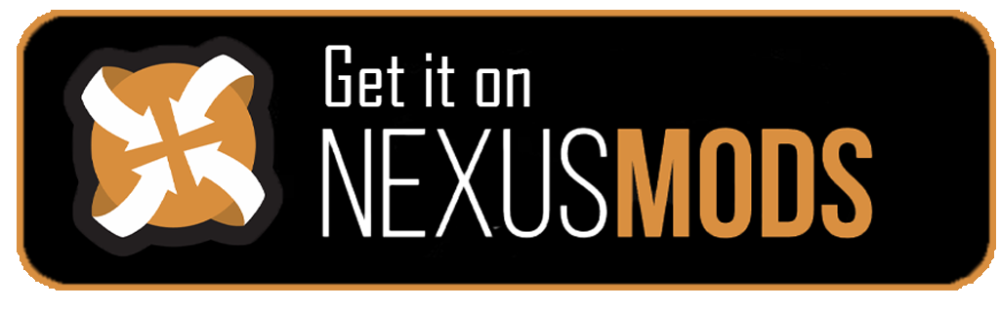

[ICON PLACEHOLDER]
 

 

# Please Note!!!

**I take no responsibility for any problems that may occur or any assets that get redistributed without permission!**

# Description

This is a dynamic patching tool for the Skyrim mod RaceMenu by expired6978 to work with different ui overhaul mods.
**No assets or files by the original mod author (expired6978) get redistributed! Patching takes place exclusively locally and redistribution of the patched files is strictly prohibited according to expired6978's permissions.**
The tool requires a compatible patch to work. More info on this can be found in the documentation (coming soon!).

# Features
- Fully automated patching
- Automatic extraction of BSA
- Can be installed as a mod in MO2 or Vortex

# Contributing

### 1. Feedback (Suggestions/Issues)

If you encountered an issue/error or you have a suggestion, create an issue under the "Issues" tab above.

### 2. Code contributions

1. Install Python 3.11 (Make sure that you add it to PATH!)
2. Clone repository
3. Open terminal in repository folder
4. Type in following command to install all requirements:
   `pip install -r requirements.txt`

### 3. Execute from source

1. Open terminal in src folder
2. Execute main file
    `python main.py`

### 4. Compile and build executable

1. Follow the steps on this page [Nuitka.net](https://nuitka.net/doc/user-manual.html#usage) to install a C Compiler
2. Run `build.bat` with activated virtual environment from the root folder of this repo.
3. The executable and all dependencies are built in the main.dist-Folder.

# How it works
1. Extracts RaceMenu BSA to a temp folder.
2. Initializes FFDec commandline interface.
3. Patches shapes.
4. Converts SWF to XML.
5. Patches XML according to patch.json (see Docs for more).
6. Converts XML back to SWF.
7. Copies SWF to current directory.

# Credits
- Qt by The [Qt Company Ltd](https://qt.io)
- [bethesda-structs](https://github.com/stephen-bunn/bethesda-structs) by [Stephen Bunn](https://github.com/stephen-bunn)
- [FFDec](https://github.com/jindrapetrik/jpexs-decompiler) by [Jindra Petřík](https://github.com/jindrapetrik)
